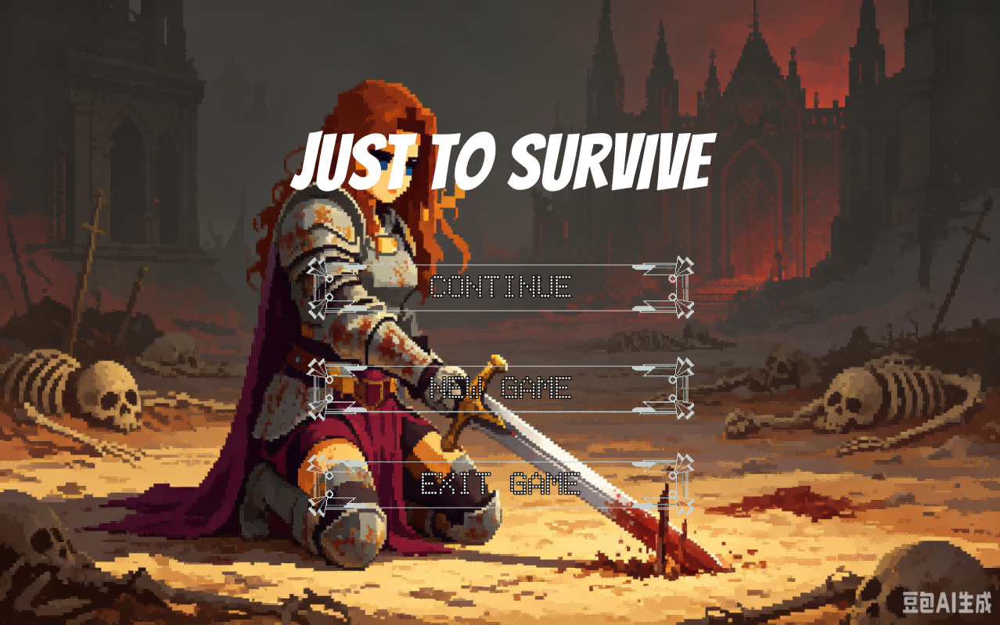
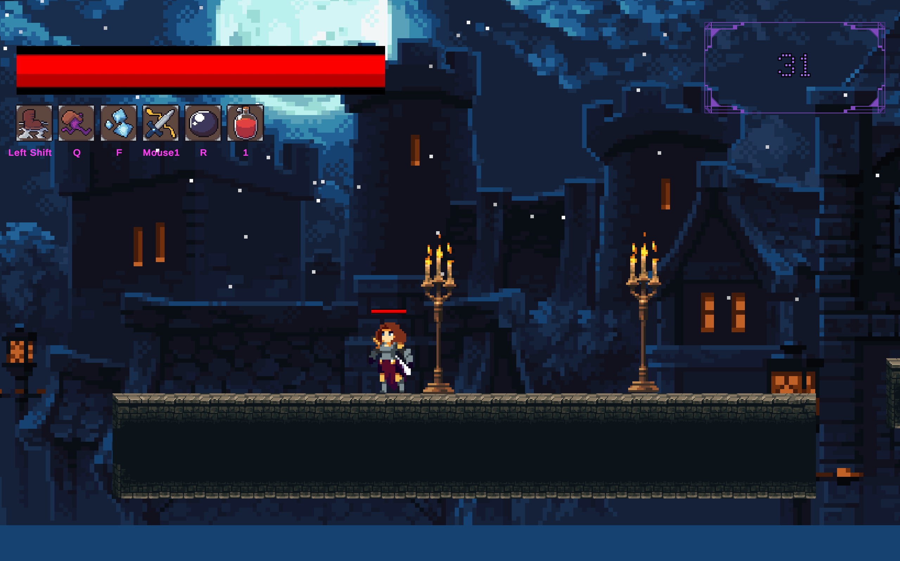
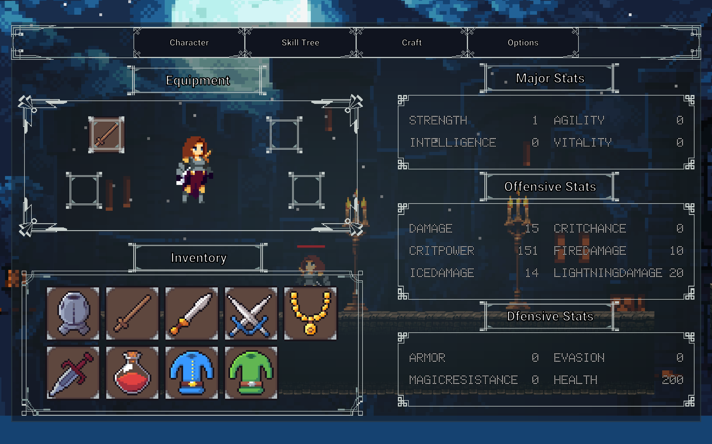
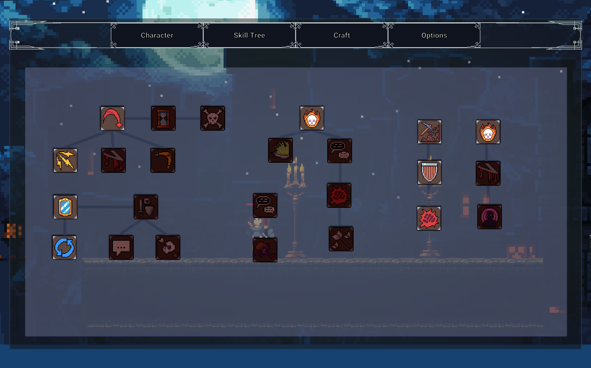
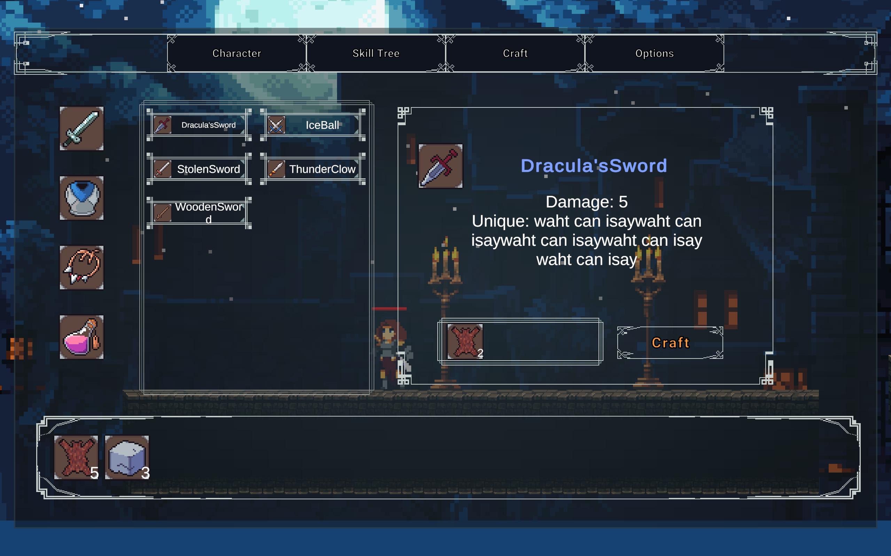
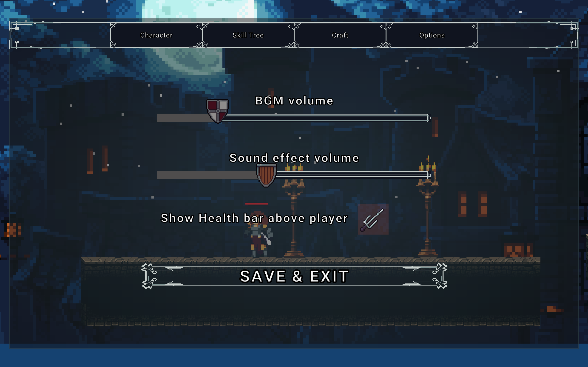

# 说明文档
本项目主要是对AlexDev的`The Ultimate Guide to Creating an RPG Game in Unity`项目的学习。
## 开发环境

Unity 版本：2022.3.62f3c1 LTS

操作系统：Windows

## build 
将项目拉取后使用对应版本的编辑器打开，选择`build and run`。假如构建web版本的，需要将`Asserts/Scripts/SaveAndLoad/SaveManager.cs`中的相关语句进行修改。

## 界面说明
### 初始界面
主要有三个按键：`continue`, `new game`, `exit game`，背景由豆包生成，剑尖的位置稍微有些问题。初次游玩时，`continue`按键被隐藏。

### 主要界面
主要界面左上角是血条以及各个技能的冷却图标，右侧是当前获得的灵魂数量

#### 基础信息界面
左侧显示的角色的装备以及库存装备栏

#### 技能树
显示各个技能。此处的技能图标可能有所问题，但是基本功能以及前置锁、分支锁等已经实现。

#### 制作装备界面
装备制作，制作的装备会直接到库存里，但是当库存满了后无法继续制作

#### 设置界面
设置简单的混合声音的音量，这一部分较为粗糙

